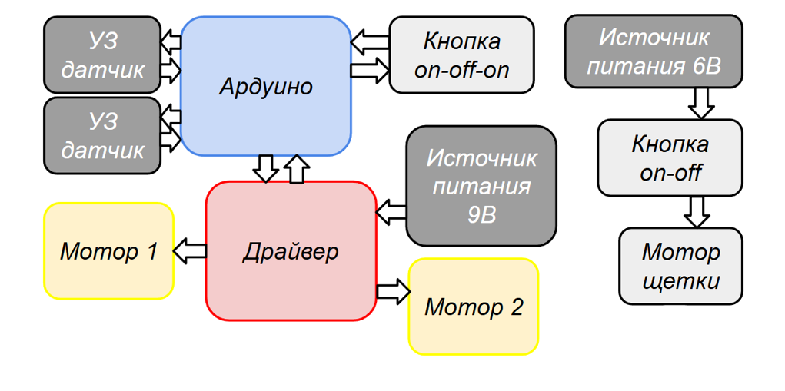
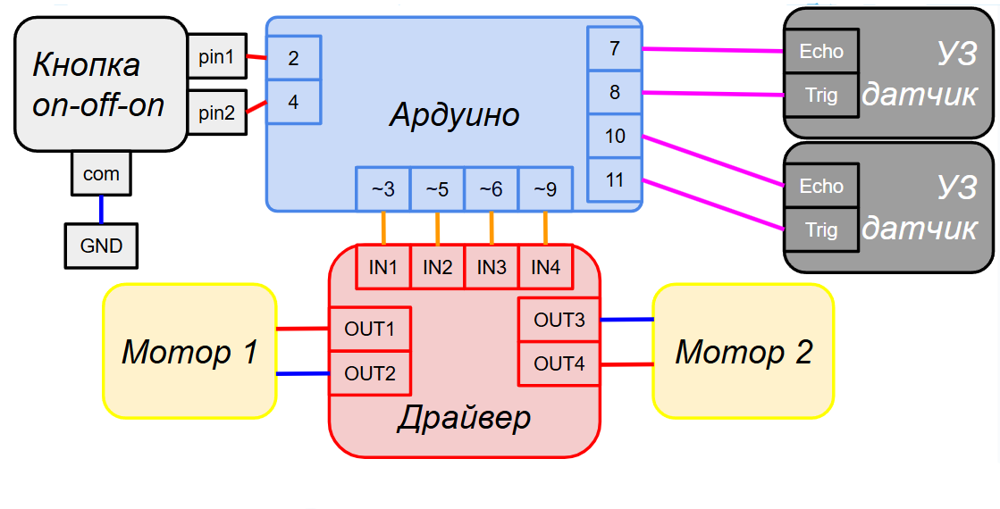

# Робот-пылесос

---
## Цель работы
Освоить технологии использования микроконтроллеров посредством выполнения интересного "эффектного" проекта. В качестве такового был выбран **робот-пылесос**.
## Задачи
- Составить список подходящих компонентов робота.
- сделать корпус из фанеры.
- Разработать логику взаимодействия компонентов робота.
- Запрограммировать микроконтроллер на минимум 1 режим работы робота.
- Прикрепить компоненты к корпусу.
## Ход работы
### Компоненты
Подобраны необходимые и достаточные компоненты робота.
- Щётки
- Винты **М3х16** и гайки **М3**
- Шаровые опоры
- Драйвер **L289N**
- УЗ датчики расстояния **HC-SRO4**
- выключатели **on-off-on** и **on-off**
- Arduino UNO
- Электромоторы
- Провода, клеммы, батарейки

### Логика взаимодействия компонентов

### Программирование
Реализованы 2 режима:
#### [Ручной](pilesas.ino#L168):

Переменная n = 3 — количество витков спирали. Движение от центра:
Для каждого витка i:
1) Едет i секунд вперёд.
2) Поворачивает направо.
3) Едет i секунд вперёд.
4) Поворачивает направо.
5) Разворот (один поворот направо).
6) Движение к центру: Аналогично, но в обратном порядке: от i = n до 1, с поворотами налево.

#### [Автоматический](pilesas.ino#L143):

С помощью УЗ-датчиков измеряются расстояния до препятствий слева (cm_L) и справа (cm_R). В зависимости от значений:
- Если путь свободен (обе стороны ≥ 10 см) → ехать вперёд.
- Если препятствие слева, но справа свободно → ехать вправо (объезд).
- Если препятствие справа, но слева свободно → ехать влево.
- Если с обеих сторон препятствия (оба < 25 см) → сделать разворот на месте (назад + два поворота вправо).

## Итоги
1) Освоена работа с микроконтроллером **Arduino UNO**
2) Создана работающая модель робота-пылесоса.
